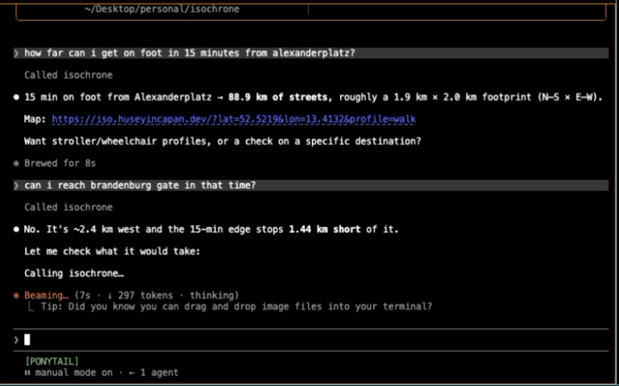

# isochrone

[](https://iso.huseyincapan.dev)
[](https://github.com/capan/isochrone/actions/workflows/uptime.yml)

**Live: [iso.huseyincapan.dev](https://iso.huseyincapan.dev)**

Click anywhere on the map and see the street network you can actually reach on
foot within 15 minutes — coloured by arrival time, with mobility profiles that
account for stairs and unpaved paths.

OSM data → PostGIS + pgRouting → Express → Leaflet.

## How it works

`pgr_drivingDistance` walks the street graph from the vertex nearest your click
until the time budget runs out, and returns every reachable edge with its
arrival time. Those edges are grouped into 10 equal time bands and drawn
directly — no hull, so the map shows the streets you can reach rather than a
blob implying you can cross the middle of a block.

Edge cost is `length / speed` in seconds, computed per request from the
selected profile, so a profile is a few numbers rather than a schema change:

| profile | speed | stairs | unpaved |
|---|---|---|---|
| `walk` | 1.4 m/s | half speed | normal |
| `stroller` | 1.2 m/s | impassable | 0.6× |
| `wheelchair` | 0.9 m/s | impassable | impassable |

These factors are estimates, not measurements — see *Calibration* below.

## Ask Claude about it (MCP)

The [`isochrone-mcp`](https://www.npmjs.com/package/isochrone-mcp) package lets
any MCP client answer reachability questions against this API:

```bash
claude mcp add isochrone -- npx -y isochrone-mcp
```

<!-- 1320px source shown at 660 — 2x density, so it stays sharp on retina -->



One tool, `reachable_area`: origin + minutes + profile, optional target
("can I get there in time?"). Returns a prose summary and a map link, not
coordinate soup. Details in [mcp/](mcp/).

## Dev

Needs Postgres (PostGIS + pgRouting) on 5454 and Redis on 6363:

    docker compose up -d db redis

Import a city (needs `osm2pgrouting`, `osmium-tool` and `libpq` on PATH —
`export PATH="/opt/homebrew/opt/libpq/bin:$PATH"` on macOS):

    cd overpass/osm-imports && ./import_city.sh germany berlin

Then:

    cd isochrone-backend && npm i && npm start   # :3001
    cd isochrone-ui && npm i && npm run dev      # :5173, proxies /api

## Deploy

    cp .env.example .env      # change PGPASSWORD, set SITE_ADDRESS
    docker compose up -d --build

Caddy terminates TLS on 80/443 (automatic Let's Encrypt once `SITE_ADDRESS` is
a real hostname), compresses responses, and proxies to the app — which serves
the API and the built UI together, so there's no separate web server. The app
port is not published; it is reachable only through Caddy. Postgres and Redis
bind to `127.0.0.1` so the import script works from the host without exposing
them publicly.

`CITY` selects which schema to query and must match the imported one
(`import_city.sh greater-london` creates schema `greater_london`).

### Getting a city into the deployment

The database starts empty. Rather than running `osm2pgrouting` on the server —
which needs `osmium`, a 1.6GB intermediate file, and a long import — dump the
schema from a machine that already has it and restore:

    pg_dump -h 127.0.0.1 -p 5454 -U postgres -d osm_db \
      --schema=berlin -Fc -Z6 -f berlin.dump          # ~105MB, ~10s

    # on the target, extensions first — a --schema dump doesn't carry them
    psql -h 127.0.0.1 -p 5454 -U postgres -d osm_db -c \
      "CREATE EXTENSION IF NOT EXISTS postgis;
       CREATE EXTENSION IF NOT EXISTS pgrouting;
       CREATE EXTENSION IF NOT EXISTS hstore;"

    pg_restore -h 127.0.0.1 -p 5454 -U postgres -d osm_db \
      --no-owner -j4 berlin.dump                       # ~5s

Berlin restores to ~587MB (the source schema is larger only because of dead
tuples from the cost UPDATEs). The `db` image is pinned to the major version the
dump came from — a dump will not restore into an older Postgres.

To generate live "where should I live" suggestions, precompute the reach field
(walking distance to the nearest amenity per grid cell):

    cd scripts && node --loader ts-node/esm precompute-reach.ts

The precompute is off-box, unattended, takes ~9 hours for Berlin, and is
resumable. It must **never** run against production — pgRouting's C loops ignore
cancellation, so only `pg_terminate_backend` can stop a runaway traversal.

### Verifying a deployment

    API=https://iso.example.com node scripts/check.mjs

## Checks

    node scripts/check.mjs     # needs the backend running

Asserts every time band comes back and that reach is non-increasing across
`walk` → `stroller` → `wheelchair`.

## Warming the cache

`scripts/precompute.ts` and the RabbitMQ `producer.ts`/`worker.ts` pair drive
the backend over HTTP rather than reimplementing the routing SQL, so they can't
drift out of sync with it. Live queries are ~0.4s, so this is only worth
running for a city-wide sweep.

## Known gaps

- **Graph islands.** The vertex nearest a click can sit on a disconnected
  fragment — `52.515,13.400` reaches 13 nodes. Fix is a one-time
  `pgr_connectedComponents` table for the vertex lookup to join against.
- **Calibration.** The speeds above are guesses. Google's Isochrones API
  (Preview) supports `WALK` and returns GeoJSON, so the `walk` profile could be
  calibrated against it. It has no stroller/wheelchair mode, so those stay
  unvalidated.
- **Stranded origins** render as a tiny blob rather than saying "unreachable
  with this profile".
