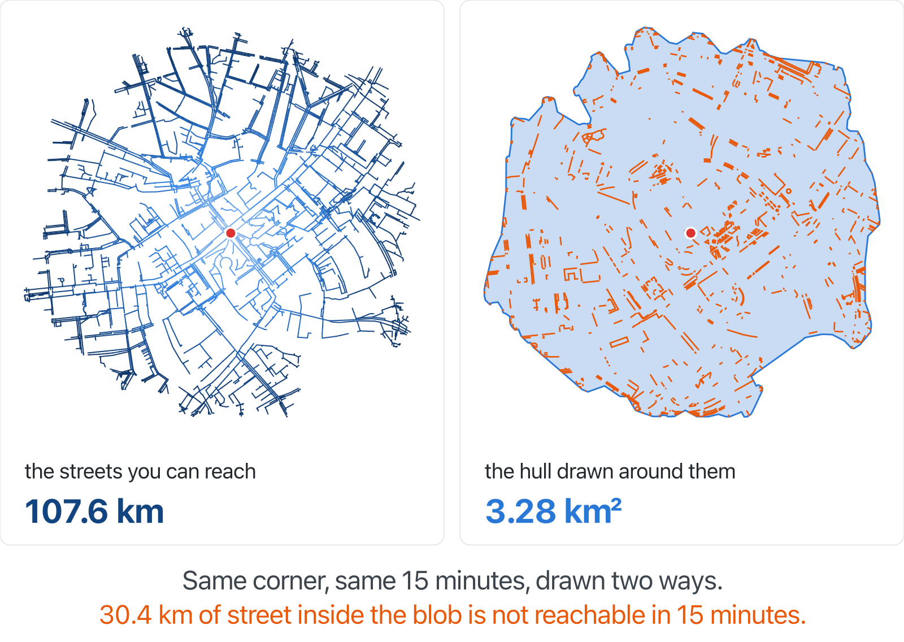

# isochrone

[](https://iso.huseyincapan.dev)
[](https://github.com/capan/isochrone/actions/workflows/uptime.yml)

**Live: [iso.huseyincapan.dev](https://iso.huseyincapan.dev)**

Click anywhere on the map and see the street network you can actually reach on
foot within 15 minutes — coloured by arrival time, with mobility profiles that
account for stairs and unpaved paths.

OSM data → PostGIS + pgRouting → Express → Leaflet.



## Why not a polygon?

Every isochrone map I could find answers with a filled polygon. That is wrong
unless you are a pigeon: a polygon claims you can reach the middle of a block,
cross a rail cutting, walk through a building. On the corner above, the same
15 minutes gives you 107.6 km of reachable streets; the hull drawn around them
covers 3.28 km² and claims 30.4 km of street the walk cannot actually reach.
This map draws the network.

## How it works

`pgr_drivingDistance` walks the street graph from the vertex nearest your click
until the time budget runs out, and returns every reachable edge with its
arrival time. Those edges are grouped into 10 equal time bands and drawn
directly.

Edge cost is `length / speed` in seconds, computed per request from the
selected profile, so a profile is a few numbers rather than a schema change:

| profile | speed | stairs | unpaved |
|---|---|---|---|
| `walk` | 1.4 m/s | half speed | normal |
| `stroller` | 1.2 m/s | impassable | 0.6× |
| `wheelchair` | 0.9 m/s | impassable | impassable |

These factors are estimates, not measurements — see *Known gaps*.

## Where should I live?

Answer a short questionnaire weighting seven everyday layers (dining, green
space, playgrounds, groceries, health, kindergartens, schools) and the whole
Berlin map re-ranks to show where *your* weighted 15-minute city actually is,
as walk, bike or wheelchair.

The trick is that nothing is routed at question time: 21 full-city
reachability surfaces (7 layers × 3 profiles, ~134,000 grid cells each) are
precomputed offline, so re-ranking the city is one aggregate query. Stroller
is deliberately absent here: its speed factors are uncalibrated estimates and
must not be published as if measured.

## Ask Claude about it (MCP)

The [`isochrone-mcp`](https://www.npmjs.com/package/isochrone-mcp) package lets
any MCP client answer reachability questions against this API:

```bash
claude mcp add isochrone -- npx -y isochrone-mcp
```

<!-- 1320px source shown at 660 — 2x density, so it stays sharp on retina -->


One tool, `reachable_area`: origin + minutes + profile, optional target
("can I get there in time?"). Returns a prose summary and a map link, not
coordinate soup. Details in [mcp/](mcp/).

## Known gaps

- **Graph islands.** The vertex nearest a click can sit on a disconnected
  fragment — `52.515,13.400` reaches 13 nodes. Fix is a one-time
  `pgr_connectedComponents` table for the vertex lookup to join against.
- **Calibration.** The speeds above are guesses. Google's Isochrones API
  (Preview) supports `WALK` and returns GeoJSON, so the `walk` profile could be
  calibrated against it. It has no stroller/wheelchair mode, so those stay
  unvalidated.
- **Stranded origins** render as a tiny blob rather than saying "unreachable
  with this profile".

## Running it yourself

Dev setup, deployment, city import and the ops notes live in
[docs/OPERATIONS.md](docs/OPERATIONS.md).
